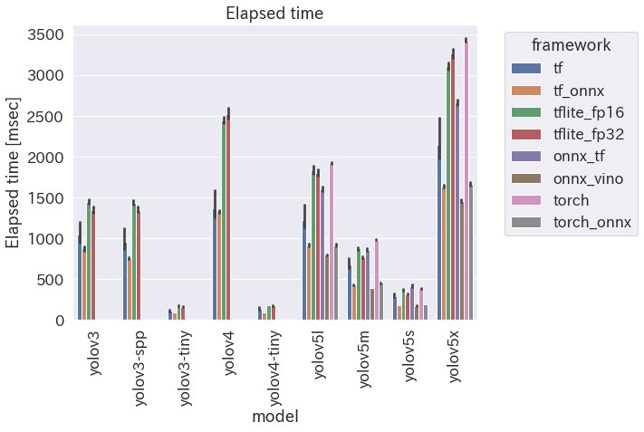
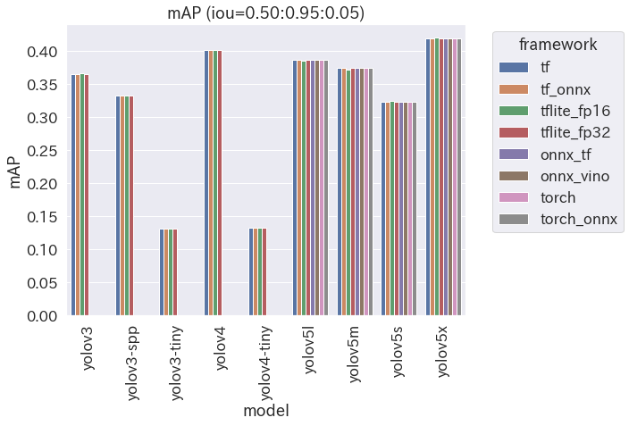
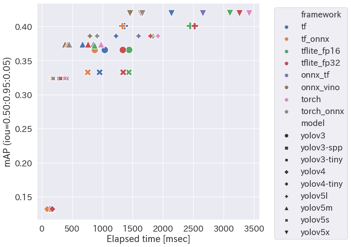

# yolo_various_framework

run YOLO (object detection model) on various frameworks and compare them

## my motivations

- I want to run object detection models on my PC
    - I don't have so much money to buy any GPU
- I want to know which framework is the best in the meaning of elapsed time
- I want to confirm that the predicted results are not so much different when I convert pre-trained weights to another framework

## object deteciton models

- [YOLO V3](https://github.com/pjreddie/darknet)
    - yolov3-tiny
        - input image size: 512x512
    - yolov3
        - input image size: 512x512
    - yolov3-spp
        - input image size: 512x512
- [YOLO V4](https://github.com/AlexeyAB/darknet)
    - yolov4-tiny
        - input image size: 512x512
    - yolov4
        - input image size: 512x512
    - [IN-PROGRESS] yolov4-csp ([Scaled-YOLOv4](https://github.com/WongKinYiu/ScaledYOLOv4/tree/yolov4-csp))
        - input image size: 512x512
    - [IN-PROGRESS] yolov4x-mish ([YOLOv4-large P5](https://github.com/WongKinYiu/ScaledYOLOv4/tree/yolov4-large))
        - input image size: 512x512
- [IN-PROGRESS] YOLO V3 & V4 are able to run only on `tf`, `tflite` and `tf_onnx`
- [YOLO V5](https://github.com/ultralytics/yolov5)
    - yolov5s
        - input image size: 640x640
    - yolov5m
        - input image size: 640x640
    - yolov5l
        - input image size: 640x640
    - yolov5x
        - input image size: 640x640

## deep learning frameworks

all deep learing frameworks below were ran on Python 3.7.9

- PyTorch (State Dict)
    - torch 1.8.1
- TensorFlow (Frozen Graph)
    - tensorflow 2.4.1
- TensorFlow Lite (Flat Buffer)
    - tflite-runtime 2.5.0
- ONNX
    - onnxruntime 1.7.0
- OpenVINO
    - OpenVINO 2021.2.185

## libraries to convert

- onnx 1.8.1
- onnx-tf 1.7.0
- tf2onnx 1.8.4

## preparation

- download font and trained model of super-resolution for detector
    - `./download_font.sh`
    - `./download_superres.sh`
- download COCO dataset and create small dataset (convert annotations)
    - see [datasets/README](https://github.com/tetutaro/yolo_various_framework/tree/main/datasets)
- download pre-trained weights
    - see [weights/README](https://github.com/tetutaro/yolo_various_framework/tree/main/weights)
- convert pre-trained weights to various frameworks
    - `./convert_yolo.py`
    - `./convert_yolov5.py`
- (if you want to calc metrics) please install [`object_detection_metrics`](https://github.com/tetutaro/object_detection_metrics)
    - `> pip install "git+https://github.com/tetutaro/object_detection_metrics.git"`

## usage

```
usage: detect.py [-h]
    -m {yolov3-tiny,yolov3,yolov4-tiny,yolov4,yolov5s,yolov5m,yolov5l,yolov5x}
    -f {torch,torch_onnx,onnx_vino,onnx_tf,tf,tflite,tf_onnx}
    [-q {fp32,fp16,int8}]
    -d IMAGE_DIR
    [-c CONF_THRESHOLD]
    [-i IOU_THRESHOLD]
    [--disable-clarify-image]
    [--disable-use-superres]
    [--disable-soft-nms]
    [--disable-iou-subset]

detect objects from images

optional arguments:
  -h, --help            show this help message and exit
  -m MODEL, --model MODEL
                        model name
  -f FRAMEWORK, --framework FRAMEWORK
                        framework
  -q QUANTIZE, --quantize QUANTIZE
                        quantization mode (TensorFlow Lite only)
                        default: fp32
  -d IMAGE_DIR, --image-dir IMAGE_DIR
                        directory contains images to detect objects
  -c CONF_THRESHOLD, --conf-threshold CONF_THRESHOLD
                        threshold of confidence score to adopt bounding boxes
                        default: 0.3
  -i IOU_THRESHOLD, --iou-threshold IOU_THRESHOLD
                        threshold of IoU to eliminte bounding boxes in NMS
                        default: 0.45
  --disable-clarify-image
                        disable image preprocessing
  --disable-use-superres
                        disable using Super-Resolution at image preprocessing
  --disable-soft-nms    use hard-NMS instead of soft-NMS
  --disable-iou-subset  do not eliminate small and unconfident bounding box
                        which is inside of big and confident bounding box
```

## frameworks

```
  torch                 PyTorch (state dict)
  torch_onnx            ONNX converted from PyTorch
  onnx_vino             OpenVINO converted from torch_onnx
  onnx_tf               TensorFlow (SavedModel) converted from torch_onnx
  tf                    TensorFlow (FrozenGraph)
  tflite                TensorFlow Lite
  tf_onnx               ONNX onverted from TensorFlow
```

## results

### conditions

NOTE: following data was measured under certain conditions. Just FYI.

- images: randomly selected 100 images from COCO val2017 dataset
- elapsed time includes the times for...
    - image preprocessing
        - adjusting white balance
        - smoothing image with Gaussian Blur
        - correcting contract (brighten dark areas)
        - clarify image using Super-Resolution
        - resize image and put it on the background (square, gray) image
    - inference
    - filtering bounding boxes
        - apply anchors
            - some models calc that inside the model
                - YOLO V5 (tf, tflite, tf_onnx)
        - calc confidence scores
        - NMS
            - soft NMS
            - eliminate small and unconfident bounding box which is inside of big and confident bounding box
- the size of the input image to models differs depending on the model
    - YOLO V3/V4: 512 x 512
    - YOLO V5: 640 x 640
- confidence score threshold is the same regardless of the model
    - `0.3`
- IoU threshold is the same regardless of the model
    - `0.45`
- tool for calculating mAP: [`object_detection_metrics`](https://github.com/tetutaro/object_detection_metrics) (may be WRONG!!)

### binary size

| Model | torch | torch_onnx | onnx_vino | onnx_tf | tf | tflite (fp32) | tflite (fp16) | tflite (int8) | tf_onnx |
|:---:|:---:|:---:|:---:|:---:|:---:|:---:|:---:|:---:|:---:|
| yolov3-tiny | | | | | 34MB | 34MB | 17MB | 8.6MB | 34MB |
| yolov3 | | | | | 237MB | 236MB | 118MB | 60MB | 236MB |
| yolov3-spp | | | | | 241MB | 240MB | 120MB | 61MB | 240MB |
| yolov4-tiny | | | | | 23MB | 23MB | 12MB | 5.9MB | 23MB |
| yolov4 | | | | | 246MB | 246MB | 123MB | 63MB | 246MB |
| yolov5s | 28MB | 28MB | 28MB | 28MB | 28MB | 28MB | 14MB | 7.4MB | 28MB |
| yolov5m | 82MB | 82MB | 81MB | 82MB | 82MB | 82MB | 41MB | 21MB | 82MB |
| yolov5l | 180MB | 179MB | 179MB | 180MB | 180MB | 180MB | 90MB | 46MB | 180MB |
| yolov5x | 335MB | 335MB | 335MB | 336MB | 336MB | 335MB | 168MB | 85MB | 335MB |

### my environment

- MacBook Air (Retina, 2020)
    - CPU: 1.1GHz quad core Intel Core i5
    - Memory: 16GB 3733MHz LPDDR4X

### elapsed time per each image



### accuracy (mAP: mean Average Precision)



### time vs accucary


